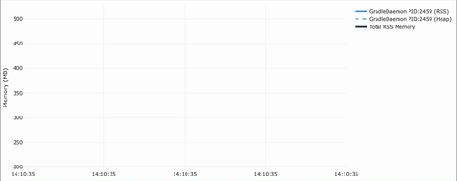
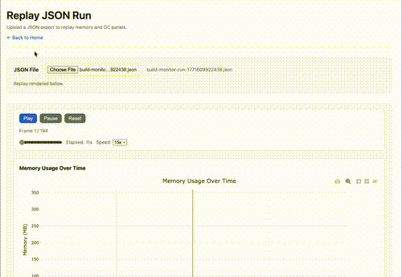
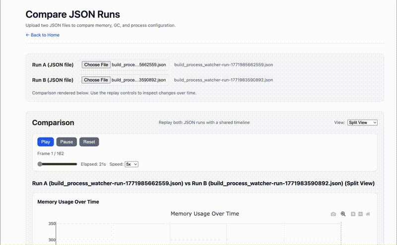

# 🧠 Build Process Watcher

[](https://github.com/marketplace/actions/build-process-watcher)

<p align="center">
  
</p>

Monitor Java/Kotlin build processes (`GradleDaemon`, `GradleWorkerMain`, `KotlinCompileDaemon`) during CI builds. Track heap, RSS, garbage collection, JIT compilation, and class loading without injecting a Java agent or changing JVM launch arguments.

---

## ✨ Quick Start

### Local Mode (Artifacts Only)

```yaml
- uses: cdsap/build-process-watcher@v0.6.2
```

Generates log files and charts as workflow artifacts.

### Remote Mode (Live Dashboard)

```yaml
- uses: cdsap/build-process-watcher@v0.6.2
  with:
    remote_monitoring: 'true'
```

Data sent to cloud backend with live dashboard (24-hour retention).  
Dashboard URL shown in job output. GC (garbage collection) monitoring is always enabled.

### Optional Metrics Export to BigQuery

```yaml
- uses: cdsap/build-process-watcher@v0.6.2
  with:
    remote_monitoring: 'true'
    export_to_bigquery: 'true'
```

This is not required for normal local or remote monitoring. Use it only when you want to collect run metrics in your own BigQuery dataset for longer-term analysis.

---

## 📋 Inputs

| Input | Description | Default | Required |
|-------|-------------|---------|----------|
| `remote_monitoring` | Enable cloud dashboard | `false` | No |
| `run_id` | Custom run identifier | Auto-generated | No |
| `log_file` | Local log filename | `build_process_watcher.log` | No |
| `interval` | Polling interval (seconds) | `5` | No |
| `debug` | Enable debug logging | `false` | No |
| `disable_summary_output` | Disable GitHub Actions summary output | `false` | No |
| `export_to_bigquery` | Optional metrics export to BigQuery when Remote Mode finishes | `false` | No |
| `predictive_reliability` | Opt in to advisory predictive reliability checkpoints; implies Remote Mode and BigQuery export | `false` | No |

**Environment variables (for Remote Mode):** Set `BACKEND_URL` and `FRONTEND_URL` as env vars (e.g. from secrets) for custom URLs. If unset, default Cloud Run and dashboard URLs are used.

**BigQuery export is optional:** It is only for collecting metrics in BigQuery. Set `export_to_bigquery: 'true'` together with `remote_monitoring: 'true'` when you want that export. Predictive reliability also requests BigQuery export automatically. The backend service must be configured with `BIGQUERY_EXPORT_DATASET`; optional table overrides are `BIGQUERY_EXPORT_TABLE` and `BIGQUERY_EXPORT_PROCESSES_TABLE`.

**Predictive reliability is opt-in and advisory:** Public builds keep prediction disabled by default. Set `predictive_reliability: 'true'` when you want a run to request predictive reliability checkpoints; this automatically enables Remote Mode and requests BigQuery export for the run. Predictions are advisory signals for triage and should not be treated as guaranteed OOM, timeout, or failure outcomes.

When run data contains public-safe `prediction_checkpoints`, the dashboard renders those checkpoint records in observation-window order. The public contract intentionally omits non-public implementation details, exact checkpoint policy, training data, and service endpoints.

`PREDICTIVE_RELIABILITY_CHECKPOINTS` can set a comma-separated checkpoint window list. When a production provider is enabled and this value is empty, the backend uses `60,300,600,1200`.

The public backend sends only public run telemetry to `/predict` and stores only the returned public-safe checkpoint. Do not add private model names, thresholds, feature formulas, training data paths, or customer-specific tuning to this repository or to public frontend config.

The reusable workflow `.github/workflows/predictive-contract-smoke.yml` validates this public contract end to end. It runs the public action with `predictive_reliability: 'true'`, waits for the action post-step to finish the backend run, and verifies that the public backend stores samples plus ready expected checkpoints. Provider deployment pipelines can call this workflow after deploy without exposing private provider internals.

---

## 🧭 Behavior Matrix

| Mode | Debug | Summary | Debug logs in artifacts | Notes |
|------|-------|---------|-------------------------|-------|
| Local | `false` | ✅ (default) | ❌ | CSV/SVG/log generated locally. |
| Local | `true` | ✅ (default) | ✅ | Copies `backend_debug*.log` and `script_debug*.log` into artifacts. |
| Local | `any` | ❌ (`disable_summary_output: true`) | depends on debug | Summary suppressed when disabled. |
| Remote | `false` | ✅ (default) | ❌ | Dashboard URL shown; local artifacts if log exists. |
| Remote | `true` | ✅ (default) | ✅ | Debug logs copied into artifacts. |
| Remote | `any` | ❌ (`disable_summary_output: true`) | depends on debug | Summary suppressed when disabled. |

---

## 🧪 Run CI Locally with act

You can execute the local CI workflow using `act`:

```bash
act -W .github/workflows/test-action-local.yml
```

To run a single job:

```bash
act -W .github/workflows/test-action-local.yml -j local-mode
```

---

## 📊 Outputs

### Local Mode
- `build_process_watcher.log` - Raw memory data
- `memory_usage.svg` - SVG chart
- `gc_time.svg` - GC time chart
- `jit_compilation.svg` - JIT compiled methods chart when JIT metrics are available
- `class_loading.svg` - Classes loaded chart when class-loading metrics are available
- `build_process_watcher.json` - Replay/Compare-compatible data export
- `build_process_watcher.csv` - Tabular metrics export
- GitHub Actions job summary with Mermaid chart

### Remote Mode
- Live dashboard URL (in job output)
- Data retention: 24 hours
- Real-time process monitoring
- GC time metrics
- JIT compilation totals and interval activity when `jstat -compiler` is supported
- Class-loading totals and classes-per-second activity when `jstat -class` is supported
- GitHub Actions job summary (unless `disable_summary_output: 'true'` is set)

---

## 📸 Screenshots

### Interactive Dashboard


The dashboard shows:
- Memory usage over time for all monitored processes
- Individual process metrics (RSS, Heap Used, Heap Capacity)
- Aggregated memory consumption
- Interactive charts with Plotly.js
- Conditional JIT and class-loading panels; older runs keep the existing layout

### JIT and Class-Loading Metrics

The watcher calls the JDK's external `jstat` tool at the normal monitoring interval. It stores cumulative compiler and class-loading counters and derives activity rates between actual observations. Missing, unsupported, or failed counters are recorded as `null`; memory and GC collection continue independently.

`jstat` availability and attach permissions vary by JVM and environment. Compilation time is compiler-thread elapsed time and should not be treated as process CPU time or compared as a JVM-independent performance verdict. To measure local collection cost for a representative JVM, run `scripts/benchmark-jstat-metrics.sh <pid>`.

### GitHub Actions Summary


The job summary includes:
- Combined Mermaid flowchart showing RSS, heap, GC, JIT compilation, and class-loading progression at representative checkpoints
- Aggregated RSS and GC totals at each checkpoint
- Per-process statistics (max, average, final measurements)
- Timeline of monitoring session

---

## 📂 Replay & Compare Runs

The dashboard lets you:

- **Replay a run** – Upload an exported JSON file to replay memory, GC, JIT, and class-loading charts offline.
- **Compare runs** – Upload two JSON files to compare two runs in overlay or side-by-side views with a shared timeline.

<p align="center">
  <br><br>
  
</p>

**Using without Remote Mode:** You don't need Remote Mode to use Replay and Compare. With Local Mode, the action generates JSON files in the workflow artifacts. Download the JSON from your artifacts and upload it to [Replay](https://process-watcher.web.app/replay.html) or [Compare](https://process-watcher.web.app/compare.html). You can also open these HTML files locally in your browser.

---

## 🏗️ Architecture

- **Frontend**: Firebase Hosting (static dashboard)
- **Backend**: Google Cloud Run (Go API)
- **Database**: Firestore (24-hour TTL)

---

## 📝 License

MIT
