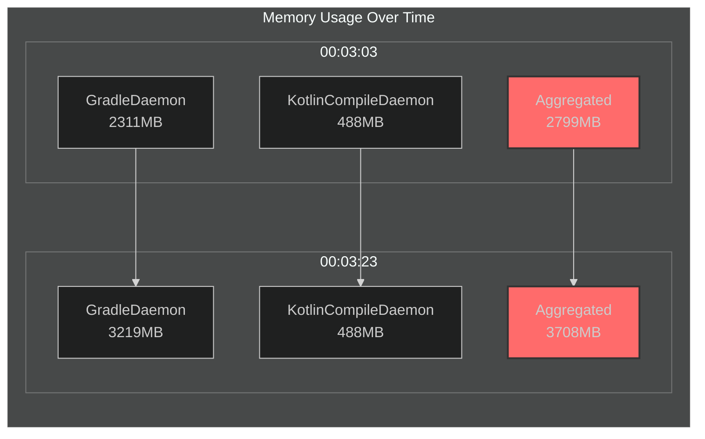

# 🧠 Build Process Watcher

[](https://github.com/marketplace/actions/build-process-watcher)




Monitor memory usage of Java/Kotlin build processes (`GradleDaemon`, `GradleWorkerMain`, `KotlinCompileDaemon`) during CI builds. Track heap and RSS usage, generate charts, and visualize data in real-time dashboards.

---

## ✨ Quick Start

### Local Mode (Artifacts Only)

```yaml
- uses: cdsap/build-process-watcher@v0.5.1
  with:
    remote_monitoring: 'false'
```

Generates log files and charts as workflow artifacts.

### Remote Mode (Live Dashboard)

```yaml
- uses: cdsap/build-process-watcher@v0.5.1
  with:
    remote_monitoring: 'true'
    collect_gc: 'true'  # Enabled by default, can be set to 'false' to disable
    disable_summary_output: 'false'  # Set to 'true' to disable GitHub Actions summary when remote
```

Data sent to cloud backend with live dashboard (24-hour retention).  
Dashboard URL shown in job output.

**Note:** By default, GC collection is enabled. Set `collect_gc: 'false'` to disable it. When using remote monitoring, you can disable the GitHub Actions summary output by setting `disable_summary_output: 'true'`.

---

## 📋 Inputs

| Input | Description | Default | Required |
|-------|-------------|---------|----------|
| `remote_monitoring` | Enable cloud dashboard | `false` | No |
| `backend_url` | Custom backend URL | Default Cloud Run URL | No |
| `run_id` | Custom run identifier | Auto-generated | No |
| `log_file` | Local log filename | `build_process_watcher.log` | No |
| `interval` | Polling interval (seconds) | `5` | No |
| `debug` | Enable debug logging | `false` | No |
| `collect_gc` | Enable garbage collection monitoring (requires Java processes) | `true` | No |
| `disable_summary_output` | Disable GitHub Actions summary output | `false` | No |
| `frontend_url` | Frontend URL for dashboard override | Auto-detected | No |

---

## 🧭 Behavior Matrix

| Mode | Debug | Summary | Debug logs in artifacts | Notes |
|------|-------|---------|-------------------------|-------|
| Local | `false` | ✅ (default) | ❌ | CSV/SVG/log generated locally. |
| Local | `true` | ✅ (default) | ✅ | Copies `backend_debug*.log` and `script_debug*.log` into artifacts. |
| Local | `any` | ❌ (`disable_summary_output: true`) | depends on debug | Summary suppressed when disabled. |
| Remote | `false` | ✅ (default) | ❌ | Dashboard URL shown; local artifacts if log exists. |
| Remote | `true` | ✅ (default) | ✅ | Debug logs copied into artifacts. |
| Remote | `any` | ❌ (`disable_summary_output: true`) | depends on debug | Summary suppressed when disabled. |

---

## 🧪 Run CI Locally with act

You can execute the local CI workflow using `act`:

```bash
act -W .github/workflows/test-action-local.yml
```

To run a single job:

```bash
act -W .github/workflows/test-action-local.yml -j local-mode
```

---

## 📊 Outputs

### Local Mode
- `build_process_watcher.log` - Raw memory data
- `memory_usage.svg` - SVG chart
- `gc_time.svg` - GC time chart (if `collect_gc` is enabled)
- GitHub Actions job summary with Mermaid chart

### Remote Mode
- Live dashboard URL (in job output)
- Data retention: 24 hours
- Real-time process monitoring
- GC time metrics (if `collect_gc` is enabled)
- GitHub Actions job summary (unless `disable_summary_output: 'true'` is set)

---

## 📸 Screenshots

### Interactive Dashboard


The dashboard shows:
- Memory usage over time for all monitored processes
- Individual process metrics (RSS, Heap Used, Heap Capacity)
- Aggregated memory consumption
- Interactive charts with Plotly.js

### GitHub Actions Summary


The job summary includes:
- Mermaid flowchart showing process memory progression
- Per-process statistics (max, average, final measurements)
- Timeline of monitoring session

---

## 📂 Replay & Compare Runs

The dashboard lets you:

- **Replay a run** – Upload an exported JSON file to replay memory and GC charts offline.
- **Compare runs** – Upload two JSON files to compare two runs side-by-side with a shared timeline.

**Using without Remote Mode:** You don't need Remote Mode to use Replay and Compare. With Local Mode, the action generates JSON files in the workflow artifacts. Download the JSON from your artifacts and upload it to [Replay](https://process-watcher.web.app/replay.html) or [Compare](https://process-watcher.web.app/compare.html). You can also open these HTML files locally in your browser.

---

## 🏗️ Architecture

- **Frontend**: Firebase Hosting (static dashboard)
- **Backend**: Google Cloud Run (Go API)
- **Database**: Firestore (24-hour TTL)

---

## 📝 License

MIT
